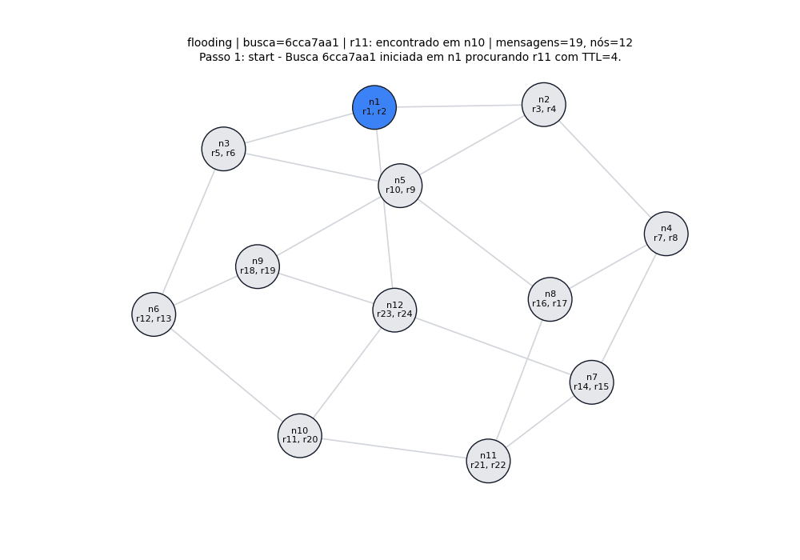
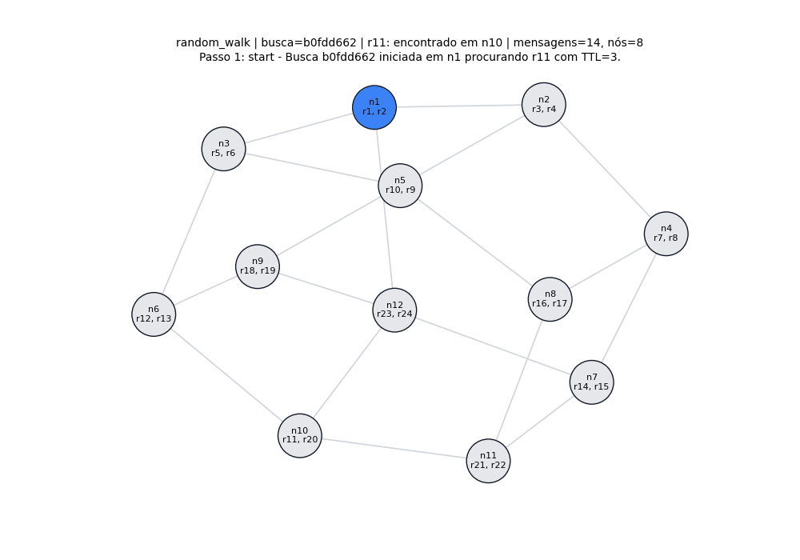

# Simulador de Busca em Redes P2P

## Identificação da equipe

- Igor Gomes Ximenes - 2217665
- Gabriel Abreu Cunha de Alencar - 2315097
- Kalil Smith Pinto Palheta - 2223857

## 1. Visão geral

Este projeto implementa um simulador de busca de recursos em uma rede P2P não estruturada. O sistema foi desenvolvido em Python e permite demonstrar, visualmente e pelo terminal, como diferentes algoritmos localizam recursos distribuídos entre nós de uma rede descentralizada.

O programa atende aos requisitos do trabalho de Computação Distribuída:

- leitura de topologia por arquivo YAML ou JSON;
- validação da rede;
- execução de buscas com TTL;
- ID único por busca;
- contagem de mensagens;
- contagem de nós envolvidos;
- rastreamento textual e visual;
- cache de localização de recursos;
- pedido direto do recurso após descobrir o nó dono;
- comparação entre algoritmos;
- demonstração visual passo a passo.

Relatório detalhado complementar: [RELATORIO.md](RELATORIO.md).

## 2. Como executar

### 2.1 Instalar dependências

```bash
python -m pip install -r requirements.txt
```

### 2.2 Validar a topologia

```bash
python main.py validate configs/sample.yaml
```

Saída esperada:

```text
Configuração válida.
Nós: 12
Recursos distintos: 24
Grau mínimo/máximo/médio: 3/4/3.17
```

### 2.3 Abrir a demonstração visual

```bash
python main.py demo configs/sample.yaml
```

Se o navegador não abrir automaticamente, acesse:

```text
http://127.0.0.1:8000
```

### 2.4 Executar busca pelo terminal

```bash
python main.py search configs/sample.yaml --origin n1 --resource r11 --ttl 4 --algo flooding --trace
```

### 2.5 Comparar algoritmos

```bash
python main.py compare configs/sample.yaml --runs 40 --ttl 4 --csv output/comparacao.csv --chart output/comparacao.png
```

### 2.6 Rodar os testes

```bash
python -m pytest -q
```

## 3. Arquivo de configuração

A rede é carregada a partir de um arquivo YAML. O arquivo principal é [configs/sample.yaml](configs/sample.yaml).

Exemplo de formato:

```yaml
num_nodes: 12
min_neighbors: 2
max_neighbors: 4

resources:
  n1: [r1, r2]
  n2: [r3, r4]

edges:
  - [n1, n2]
  - [n1, n3]
```

Na topologia principal:

- existem 12 nós;
- existem 24 recursos;
- cada nó possui dois recursos locais;
- o grau mínimo permitido é 2;
- o grau máximo permitido é 4;
- a rede é conectada.

Distribuição dos recursos:

```yaml
n1:  [r1, r2]
n2:  [r3, r4]
n3:  [r5, r6]
n4:  [r7, r8]
n5:  [r9, r10]
n6:  [r12, r13]
n7:  [r14, r15]
n8:  [r16, r17]
n9:  [r18, r19]
n10: [r11, r20]
n11: [r21, r22]
n12: [r23, r24]
```

O recurso `r11` fica no nó `n10`, pois ele é usado nos exemplos de demonstração.

## 4. Validações implementadas

Após ler o arquivo de configuração, o sistema valida automaticamente:

| Requisito | Como foi atendido |
|---|---|
| A rede não pode estar particionada | O sistema percorre o grafo e verifica se todos os nós são alcançáveis. |
| Cada nó deve respeitar mínimo e máximo de vizinhos | O grau de cada nó é comparado com `min_neighbors` e `max_neighbors`. |
| Não pode haver nó sem recurso | Cada nó precisa possuir pelo menos um item em sua lista `resources`. |
| Não pode haver aresta de um nó para ele mesmo | A configuração é recusada se existir uma aresta como `[n1, n1]`. |

Essas validações ficam principalmente nos arquivos:

- [p2p_simulator/config.py](p2p_simulator/config.py)
- [p2p_simulator/models.py](p2p_simulator/models.py)

## 5. Modelo da rede

Cada nó da rede conhece apenas:

- seu próprio ID;
- seus vizinhos diretos;
- seus recursos locais;
- seu cache local de localizações aprendidas.

Isso significa que um nó não sabe inicialmente quais recursos existem em nós distantes. A vizinhança serve para descobrir onde o recurso está. Depois que a origem descobre o nó dono, ela pode pedir o recurso diretamente para esse nó, mesmo que ele esteja distante na topologia.

Na visualização:

- mensagens de busca seguem as arestas da rede;
- aviso de recurso encontrado volta pelo caminho usado na busca;
- pedido direto aparece como linha roxa tracejada.

## 6. Algoritmos implementados

O sistema implementa quatro algoritmos:

```text
flooding
informed_flooding
random_walk
informed_random_walk
```

Todos recebem:

- `node_id` ou origem;
- `resource_id`;
- `ttl`;
- `algo`.

Na CLI:

```bash
python main.py search configs/sample.yaml --origin n1 --resource r11 --ttl 4 --algo flooding --trace
```

Na interface web, esses mesmos parâmetros aparecem em campos selecionáveis.

## 7. Flooding com inundação paralela

### 7.1 Ideia do algoritmo

Na busca por inundação, o nó de origem envia a requisição para todos os seus vizinhos. Cada vizinho verifica se possui o recurso. Se não possuir, retransmite a busca para seus próprios vizinhos, respeitando o TTL.

### 7.2 Alteração solicitada pelo professor

O professor pediu que a inundação fosse tratada como paralela. Isso significa que, mesmo quando um ramo encontra o recurso, os outros ramos que já receberam mensagens continuam tentando encontrar também.

O sistema agora funciona assim:

1. `n1` inicia a busca.
2. `n1` envia mensagens para todos os vizinhos.
3. Um dos ramos encontra o recurso em `n10`.
4. A resposta volta para `n1`.
5. Mesmo assim, outros ramos continuam executando porque eles ainda não sabem que o recurso já foi encontrado.
6. A simulação mostra esses outros nós recebendo e tentando retransmitir a busca.

Esse comportamento aparece no rastro como:

```text
parallel_continue
```

### 7.3 Demonstração em GIF



### 7.4 O que observar no GIF

- O nó azul é a origem.
- As linhas vermelhas mostram a busca sendo inundada pela rede.
- O nó verde é o nó onde o recurso foi encontrado.
- As linhas verdes mostram o aviso voltando para a origem.
- Mesmo depois do recurso ser encontrado, a animação continua mostrando outros nós recebendo mensagens, representando a inundação paralela.
- A linha roxa tracejada mostra o pedido direto do recurso após a descoberta.

Exemplo usado para gerar o GIF:

```bash
python main.py search configs/sample.yaml --origin n1 --resource r11 --ttl 4 --algo flooding --plot output/flooding_parallel.png --animate output/flooding_parallel.gif
```

Resultado típico:

```text
Algoritmo: flooding
Origem: n1
Recurso: r11
TTL: 4
Status: ENCONTRADO em n10
Mensagens da busca/resposta: 19
Nós envolvidos: 12
Caminho de aviso: n10 -> n12 -> n1
```

## 8. Random walk com backtracking

### 8.1 Ideia do algoritmo

No passeio aleatório, o nó atual escolhe apenas um vizinho para continuar a busca. Isso reduz a quantidade de mensagens quando comparado com flooding, mas pode fazer o algoritmo seguir um caminho ruim.

### 8.2 Alteração solicitada pelo professor

O professor pediu backtracking no random walk. Agora, quando um caminho não encontra o recurso, a busca volta para o nó anterior e tenta outro vizinho disponível.

O comportamento implementado é:

1. O nó atual escolhe um vizinho aleatoriamente.
2. A busca segue por esse vizinho.
3. Se o recurso não estiver naquele caminho, a busca retorna ao nó anterior.
4. O nó anterior tenta outro vizinho ainda não testado.
5. Mesmo com TTL zerado, o backtracking permite tentar outro vizinho disponível a partir do ponto de retorno.
6. O processo continua até encontrar o recurso ou esgotar as alternativas.

Esse comportamento aparece no rastro como:

```text
backtrack
```

### 8.3 Demonstração em GIF



### 8.4 O que observar no GIF

- As linhas vermelhas indicam as tentativas de busca.
- As linhas azuis tracejadas indicam o backtracking.
- O algoritmo primeiro segue por um caminho que não encontra `r11`.
- Depois volta para tentar outro vizinho.
- Ao tentar outro ramo, chega ao nó `n10`, que possui `r11`.
- O aviso volta pelo caminho reverso até `n1`.
- Por fim, aparece o pedido direto do recurso ao nó `n10`.

Exemplo usado para gerar o GIF:

```bash
python main.py search configs/sample.yaml --origin n1 --resource r11 --ttl 3 --algo random_walk --seed 42 --plot output/random_walk_backtracking.png --animate output/random_walk_backtracking.gif
```

Resultado típico:

```text
Algoritmo: random_walk
Origem: n1
Recurso: r11
TTL: 3
Status: ENCONTRADO em n10
Mensagens da busca/resposta: 14
Nós envolvidos: 8
Caminho de aviso: n10 -> n6 -> n3 -> n1
```

## 9. Buscas informadas com cache

As versões informadas são:

```text
informed_flooding
informed_random_walk
```

Elas usam cache local nos nós.

Quando uma busca encontra um recurso, os nós no caminho aprendem a localização desse recurso. Por exemplo:

```text
r11 -> n10
```

Isso significa que o nó aprendeu que `r11` está em `n10`.

Em buscas futuras, se um nó no caminho já souber onde o recurso está, ele pode responder usando cache sem esperar a busca chegar ao nó dono.

Esse comportamento atende ao requisito:

> com cache algum nó no caminho sabe onde está o recurso.

## 10. TTL

Toda busca recebe um TTL.

No flooding:

- o TTL é decrementado a cada salto;
- quando chega a zero, o nó não retransmite para novos vizinhos;
- mensagens já enviadas anteriormente continuam sendo processadas.

No random walk com backtracking:

- o TTL controla o avanço normal do passeio;
- ao voltar por backtracking, a busca pode tentar outro vizinho disponível a partir do ponto de retorno, conforme solicitado pelo professor;
- isso permite demonstrar a ideia de voltar e explorar alternativas.

## 11. Estatísticas

Ao final de cada busca, o sistema informa:

- ID da busca;
- algoritmo;
- origem;
- recurso procurado;
- TTL;
- status;
- nó que possui o recurso;
- mensagens trocadas;
- nós envolvidos;
- cache hits;
- caminho de aviso;
- mensagens de pedido direto do recurso.

Exemplo:

```text
Busca: b0fdd662
Algoritmo: random_walk
Origem: n1
Recurso: r11
TTL: 3
Status: ENCONTRADO em n10
Mensagens da busca/resposta: 14
Nós envolvidos: 8
Caminho de aviso: n10 -> n6 -> n3 -> n1
```

## 12. Interface visual

A interface visual foi criada para a apresentação ao vivo.

Comando:

```bash
python main.py demo configs/sample.yaml
```

Na tela é possível:

1. escolher o nó de origem;
2. escolher o recurso;
3. escolher o algoritmo;
4. ajustar o TTL;
5. informar seed para o random walk;
6. executar a busca;
7. avançar passo a passo;
8. voltar passos;
9. usar play/pause;
10. acompanhar estatísticas;
11. calcular mínimo e máximo por algoritmo.

### Cores da visualização

| Elemento | Significado |
|---|---|
| Nó azul claro | Origem da busca |
| Nó laranja | Nó ativo no passo atual |
| Nó amarelo | Nó já envolvido na busca |
| Nó verde | Nó onde o recurso foi encontrado |
| Linha vermelha | Mensagem de busca |
| Linha verde | Aviso de retorno para a origem |
| Linha roxa tracejada | Pedido direto do recurso |
| Linha azul tracejada | Backtracking do random walk |

## 13. Comparação entre algoritmos

O sistema permite comparar os algoritmos em termos de:

- mínimo de mensagens;
- máximo de mensagens;
- média de mensagens;
- mínimo de nós envolvidos;
- máximo de nós envolvidos;
- média de nós envolvidos;
- taxa de sucesso;
- cache hits.

Pelo terminal:

```bash
python main.py compare configs/sample.yaml --runs 40 --ttl 4 --csv output/comparacao.csv --chart output/comparacao.png
```

Pela interface visual:

1. escolha um recurso;
2. escolha um TTL;
3. clique em **Calcular min/máx do recurso**.

## 14. Seed do random walk

A seed controla a sequência pseudoaleatória usada pelo random walk.

Ela é útil porque:

- torna a demonstração reproduzível;
- permite repetir o mesmo caminho durante a apresentação;
- facilita comparar resultados.

O valor da seed não tem significado especial. O padrão `42` pode ser trocado por outro número. Se a seed mudar, o passeio aleatório pode escolher outro caminho.

## 15. Estrutura do projeto

```text
.
├── configs/
│   ├── sample.yaml
│   ├── dense.yaml
│   └── ring.yaml
├── output/
│   ├── flooding_parallel.gif
│   ├── flooding_parallel.png
│   ├── random_walk_backtracking.gif
│   └── random_walk_backtracking.png
├── p2p_simulator/
│   ├── cli.py
│   ├── config.py
│   ├── demo_server.py
│   ├── models.py
│   ├── search.py
│   └── visualize.py
├── tests/
│   └── test_simulator.py
├── main.py
├── README.md
├── RELATORIO.md
└── requirements.txt
```

## 16. Roteiro sugerido de apresentação

1. Validar a rede:

```bash
python main.py validate configs/sample.yaml
```

2. Abrir a interface:

```bash
python main.py demo configs/sample.yaml
```

3. Demonstrar flooding paralelo:

- origem: `n1`;
- recurso: `r11`;
- TTL: `4`;
- algoritmo: `flooding`.

Explique que o recurso é encontrado em `n10`, mas a inundação continua nos outros ramos porque as mensagens já estavam em andamento.

4. Demonstrar random walk com backtracking:

- origem: `n1`;
- recurso: `r11`;
- TTL: `3`;
- algoritmo: `random_walk`;
- seed: `42`.

Explique que o algoritmo tenta um caminho, volta quando não encontra e escolhe outro vizinho disponível.

5. Demonstrar cache:

- execute uma busca;
- depois execute uma busca informada;
- mostre os cache hits e explique que nós no caminho aprendem onde está o recurso.

6. Mostrar mínimo e máximo:

- selecione um recurso;
- clique em **Calcular min/máx do recurso**;
- compare mensagens e nós envolvidos entre os algoritmos.

## 17. Conclusão

O sistema demonstra de forma completa o funcionamento de algoritmos de busca em redes P2P não estruturadas. Ele permite observar tanto o comportamento textual quanto o visual de cada busca, incluindo TTL, mensagens, nós envolvidos, cache, pedido direto, flooding paralelo e random walk com backtracking.

Com a interface web, o professor pode escolher os parâmetros da busca e acompanhar a execução passo a passo, o que torna a demonstração mais clara e alinhada aos requisitos do trabalho.
